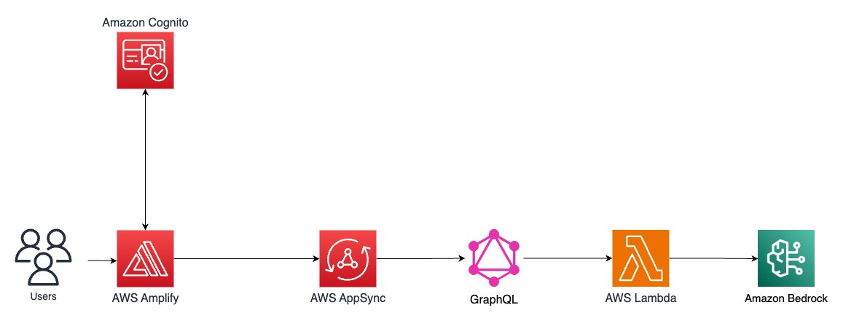

### AWS Hands-on Tutorial

# AI RECIPE GENERATOR

## Overview

In this tutorial, you will learn how to use AWS Amplify to build a serverless web application powered by Generative AI using Amazon Bedrock and the Claude 3 Sonnet foundation model. Users can enter a list of ingredients, and the application will generate delicious recipes based on the input ingredients. The application includes an HTML-based user interface for ingredient submission and a backend web app to request AI-generated recipes.

## What you will accomplish

In this tutorial, you will:

* Configure AWS Amplify to host your frontend application with continuous deployment built in


* Configure Amplify Auth and enable Amazon Bedrock foundation model Access


* Build an app backend for handling requests for your web application


* Use Amplify Data to call the serverless backend


* Connect the app to the backend

## Application Architecture

The following diagram provides a visual representation of the services used in this tutorial and how they are connected. This application uses AWS Amplify, a GraphQL API built with AWS AppSync, AWS Lambda, and Amazon Bedrock.

As you go through the tutorial, you will learn about the services in detail and find resources that will help you get up to speed with them.




Link to tutorial: [Build a Serverless Web Application using Generative AI](https://docs.aws.amazon.com/hands-on/latest/build-serverless-web-app-lambda-amplify-bedrock-cognito-gen-ai/build-serverless-web-app-lambda-amplify-bedrock-cognito-gen-ai.html?ref=gsrchandson)

## Tasks
This tutorial is divided into the following tasks. You must complete each task before moving to the next one.

* Task 1: Host a Static Website (5 minutes): Configure AWS Amplify to host your frontend application with continuous deployment built in

* Task 2: Manage Users (5 minutes): Configure Amplify Auth and enable Amazon Bedrock foundation model Access

* Task 3: Build a Serverless Backend (10 minutes): Build an app backend for handling requests for your web application

* Task 4: Deploy the Backend API (5 minutes): Use Amplify Data to call the serverless backend

* Task 5: Build the Frontend (5 minutes): Connect the app to the backend

* Task 6: Clean up Resources (2 minutes): Clean up the resources used in this tutorial


## Deploy

This project uses Amplify Gen 2. After amplify init, run:
```bash
amplify sandbox   # or amplify push for permanent env
```

## Quickstart

```bash
npm install
npm run dev
```

```bash
VITE v7.1.9  ready in 3205 ms
➜  Local:   http://localhost:5174/
➜  Network: use --host to expose
➜  press h + enter to show help
```

Go to localhost, sign up or sign in with Cognito, then enter ingredients (separated with a coma) to generate a recipe.
